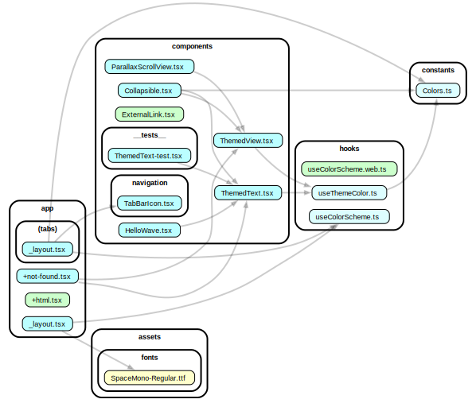

# 🍽️ Restaurant Finder App

This is a **React Native Expo** app that integrates with **Firebase** and the **Yelp API**. The app allows users to search for restaurants, list food items, and manage food items with functionalities like delete, deactivate, and more.

## 📱 Features

- 🔍 **Restaurant Search**: Search for restaurants using the Yelp API.
- 📝 **List Food Items**: View and add food items for selected restaurants.
- 🗑️ **Manage Food Items**: Delete or deactivate food items.
- 🔐 **Authentication**: User authentication using Firebase.

## 🛠️ Tech Stack

- **React Native (Expo)**
- **Firebase** (Authentication, Storage & Firestore)
- **Yelp API** (Restaurant data)

## 🚀 Getting Started

### Prerequisites

Ensure you have the following installed:

- **Node.js**: [Download here](https://nodejs.org/)
- **Expo CLI**: Install via `npm install -g expo-cli`
- **Firebase Account**: [Sign up here](https://firebase.google.com/)
- **Yelp API Key**: [Get your key here](https://www.yelp.com/developers/documentation/v3/get_started)

### 🔧 Installation

1. **Clone the repository**:
    ```bash
    git clone https://github.com/theashhar/EatsEasy.git
    cd EatsEasy
    ```

2. **Install dependencies**:
    ```bash
    npm install
    ```

3. **Start the Expo server**:
    ```bash
    npx expo start
    ```

4. **Run the app**:
    - Use the Expo Go app on your phone to scan the QR code.
    - Alternatively, press `a` to run on Android emulator or `i` for iOS simulator.

## 📂 Project Structure

Below is a visual representation of the project's file structure using a dependency graph:



## 🔑 Firebase Setup

1. Go to the [Firebase Console](https://console.firebase.google.com/).
2. Create a new project and add a Web app.

## 🗒️ Yelp API Setup

1. Go to the [Yelp Developers Portal](https://www.yelp.com/developers/v3/manage_app).
2. Create an app to get your API key.

## 🤝 Contributing

Contributions are welcome! Please fork this repository and submit a pull request for any improvements.

## 📄 License

This project is licensed under the MIT License - see the [LICENSE](LICENSE) file for details.

## 📧 Contact

For any questions or feedback, feel free to reach out:

- **Email**: theashhar.work@gmail.com
- **Twitter**: (https://x.com/the_ashhar)
